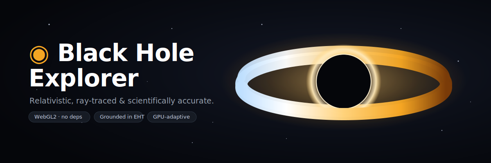
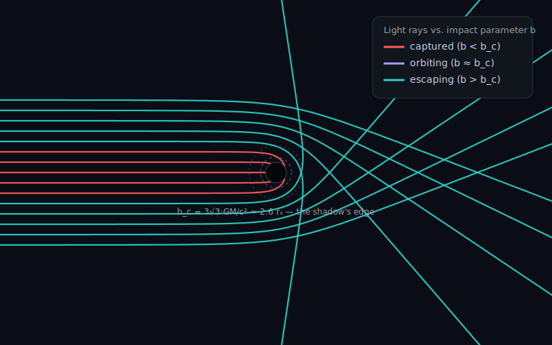

<div align="center">



# ◉ Black Hole Explorer

**A real-time, scientifically accurate, interactive black-hole simulator — right in your browser.**
Light is ray-traced through curved spacetime, so what you see is *genuine* gravitational lensing,
a relativistic accretion disk, the photon ring, and the shadow — grounded in general relativity and Event Horizon Telescope data.

[](https://muhammadmahadazher.github.io/blackhole-sim/)
&nbsp;
[](LICENSE)


</div>

---

## 🌌 What is this?

**Black Hole Explorer** traces a photon along a curved geodesic for *every pixel*, in real time on your GPU.
It's both a gorgeous visualization **and** a teaching instrument: dial in a real black hole's **mass, spin,
inclination, accretion rate and distance**, and it computes — live, in real units — the Schwarzschild radius,
ISCO, photon sphere, ergosphere, **shadow size in microarcseconds**, **Hawking temperature**, evaporation
lifetime, orbital velocity and radiative efficiency. Then throw matter in, trace light rays, and open the
**Learn** panel to understand *what's happening and what we actually know.*

> 🟢 **Try it now → [muhammadmahadazher.github.io/blackhole-sim](https://muhammadmahadazher.github.io/blackhole-sim/)**
> &nbsp;•&nbsp; or run locally in 30 seconds (below).

---

## ✨ Features

| | |
|---|---|
| 🌀 **Curved-spacetime ray tracing** | RK4 integration of null geodesics — real gravitational lensing, photon ring & shadow |
| 🔴 **Relativistic accretion disk** | Shakura–Sunyaev temperature profile, **Doppler beaming**, colour shift & gravitational redshift |
| 📐 **Real units & live readouts** | Mass, spin, inclination, distance → rₛ, ISCO, shadow (µas), Hawking T, efficiency… |
| 🌠 **Photon-path tracer** | A fan of light rays, colour-coded **captured / orbiting / escaping** — *see why the shadow exists* |
| 🪐 **Throw matter in** | Probes that spaghettify, redshift & freeze at the horizon — what a distant observer really sees |
| 🟣 **Kerr geometry overlays** | Lensed horizon, photon sphere, ISCO & ergosphere rings; spin reshapes them live |
| 🌡️ **Thermodynamics** | Hawking temperature, Bekenstein–Hawking entropy, evaporation lifetime, Hawking power |
| 🔭 **Real-object presets** | Sgr A\*, M87\*, Cygnus X-1, GW150914, TON 618, Gargantua — with citations |
| 📖 **Learn drawer + ⓘ tooltips** | 14 illustrated topics; every control explains its own physics |
| ⚡ **GPU-adaptive** | Auto-detects your GPU and scales detail to hold a smooth frame-rate |

---

## 🚀 Quick start

**The simplest way:** download the repo and **double-click `index.html`** — it just opens in your browser. ✅
To close it, close the tab. (No build step, no dependencies, ever.)

For the most reliable experience (and to always load the newest files), run the tiny local server:

<details open>
<summary><b>🪟 Windows</b></summary>

```bat
:: double-click start.bat   — or, in a terminal:
start.bat
```
It opens `http://localhost:8765` automatically. Uses **Node.js** if installed, otherwise **Python 3**.
To stop: close the tab, then press `Ctrl + C` in the little server window.
</details>

<details>
<summary><b>🍎 macOS</b></summary>

```bash
chmod +x start.sh   # first time only
./start.sh
```
Or directly: `node serve.js` (or `python3 serve.py`), then open `http://localhost:8765`.
</details>

<details>
<summary><b>🐧 Linux</b></summary>

```bash
chmod +x start.sh   # first time only
./start.sh
```
Or directly: `node serve.js` / `python3 serve.py`, then open `http://localhost:8765`.
</details>

<details>
<summary><b>📦 With Node / npm (any OS)</b></summary>

```bash
npm start          # runs the zero-dependency server (serve.js)
# then open http://localhost:8765
```
There are **no packages to install** — `npm start` just runs a small built-in static server.
</details>

> Requires a browser with **WebGL2** (Chrome, Edge, Firefox, or Safari 15+) and hardware acceleration on.

---

## 🎮 Controls

| Input | Action |
|------|--------|
| **Drag** | Orbit the black hole (full 360°) |
| **Scroll / pinch** | Zoom in & out |
| **Click the scene** / `T` | Throw a probe of matter in 🪐 |
| `L` | Open the **Learn** drawer 📖 |
| `C` | Cinematic mode (hide UI) · `Esc` to exit |
| `R` | Reset the view |
| `Space` | Toggle auto-rotation |
| `P` | Save a screenshot |
| `H` | Show / hide the control panel |
| `?` | Show the welcome / help guide |

---

## 🔬 How it works

For every pixel, a photon is launched from the camera and integrated **backwards through the Schwarzschild
geometry** with 4th-order Runge–Kutta. In geometric units (rₛ = 1) the null geodesic obeys

```
d²r/dλ²  =  −1.5 · h² · r / |r|⁵          (h = |r × v|, the photon's angular momentum)
```

Photons that reach the horizon turn black (the **shadow**); those that loop the photon sphere make the
**photon ring**; the rest sample a procedural sky — automatically **gravitationally lensed** because we
followed the bent path. A relativistic accretion disk is composited in with Doppler beaming, frequency
shift and gravitational redshift. The pipeline is HDR (bloom + ACES tone-mapping) with a cinematic grade.

The **photon-path tracer** makes the lensing literal — a fan of rays, coloured by fate:

<div align="center">

</div>

Rays with impact parameter **b < b_c** are *captured*; rays near **b_c = 3√3·GM/c² ≈ 2.6 rₛ** *orbit*
the photon sphere; rays with **b > b_c** *escape* with a deflection. That critical value is exactly what
sets the edge of the shadow.

> 📈 **Real-unit physics** lives in [`js/physics.js`](js/physics.js), verified against references
> (rₛ(Sun) = 2.95 km, Sgr A\* ring ≈ 51.8 µas, M87\* θ_g = 3.82 µas, T_H(Sun) = 6.17×10⁻⁸ K).
> The full derivations and sources are in **[docs/PHYSICS.md](docs/PHYSICS.md)**.

---

## 🖼️ Screenshots

The graphics above are crisp vector art. To capture **real screenshots** of your own session, press **`P`**
in the app (saves a PNG) and drop them into [`assets/screenshots/`](assets/screenshots/) — suggested shots:
a face-on disk + photon ring, an edge-on "Interstellar" view, and the photon-path tracer.

---

## 📂 Project structure

```
blackhole-sim/
├── index.html              # app shell (app bar · glass panel · drawer · status bar)
├── serve.js / serve.py     # zero-dependency local servers (Node / Python)
├── start.bat · start.sh    # one-click launchers (Windows · macOS/Linux)
├── package.json            # npm start → serve.js  (no dependencies)
├── css/  tokens.css · style.css      # design system (Material 3 × Apple HIG)
├── js/
│   ├── physics.js          # ★ real-unit black-hole quantities (SI), verified
│   ├── content.js          # 14 Learn topics + real-object presets w/ citations
│   ├── photons.js          # photon-path (null-geodesic) tracer
│   ├── camera.js · objects.js · ui.js · main.js · glutils.js
├── shaders/
│   ├── blackhole.frag.js   # ★ the relativistic physics shader + geometry overlays
│   ├── post.frag.js · quad.vert.js
├── docs/
│   ├── guide.html          # 🎨 illustrated guide      · PHYSICS.md · USE_NVIDIA_GPU.md
└── assets/  banner.svg · photon-paths.svg
```

---

## ⚡ Performance & GPUs

The renderer is a per-pixel geodesic integrator, so it auto-detects your GPU, shows a tier **badge**, and
**Auto** quality scales render resolution + ray-march steps to hold a smooth frame-rate. It pauses when the
tab is hidden and caps the frame-rate to stay cool. Pick **Battery** for a weak GPU or **Ultra** (1.35×
supersampling) for a strong one.

> 💻 **Gaming laptops:** hybrid-graphics machines often force the *browser* onto the integrated GPU. If the
> badge says *Integrated GPU*, a one-click banner (and **[docs/USE_NVIDIA_GPU.md](docs/USE_NVIDIA_GPU.md)**)
> shows how to switch to your dedicated card — the badge turns **green** and full quality kicks in.

---

## 📚 Documentation

- 🎨 **[docs/guide.html](docs/guide.html)** — a visual, illustrated guide (open in a browser)
- 🧮 **[docs/PHYSICS.md](docs/PHYSICS.md)** — the equations, derivations & references
- 🖥️ **[docs/USE_NVIDIA_GPU.md](docs/USE_NVIDIA_GPU.md)** — use your dedicated GPU
- ▶️ **[HOW_TO_RUN.md](HOW_TO_RUN.md)** — the 2-minute launch/stop guide

---

## 🙏 Science & credits

Built on standard general relativity & astrophysics: the **Schwarzschild** & **Kerr** metrics,
**Bardeen–Press–Teukolsky** (1972) ISCO, **Shakura–Sunyaev** (1973) / **Novikov–Thorne** disks,
**Hawking** (1975), **Luminet** (1979), **James–Thorne** (2015, the *Interstellar* renderer), and the
**Event Horizon Telescope** (2019 / 2022). UI design fuses **Google Material 3** with **Apple HIG**.

**Honest limitations:** photon paths use the Schwarzschild metric (spin drives the ISCO, ergosphere &
readouts, but not full Kerr photon frame-dragging, so the shadow stays circular); the disk is a thin
optically-thick model with bolometric-ish (δ³) beaming; disk colour is artistic while the physical peak
temperature is reported separately. See [docs/PHYSICS.md](docs/PHYSICS.md) for the full list.

---

## 📄 License

[MIT](LICENSE) © 2026 Muhammad Mahad Azher. Contributions and stars ⭐ welcome!
